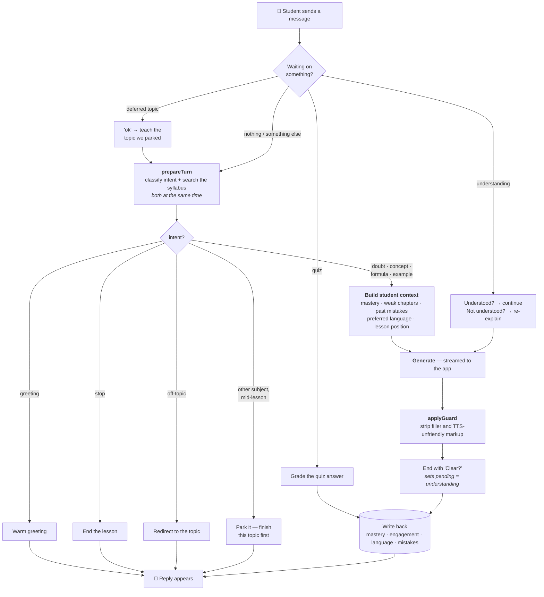
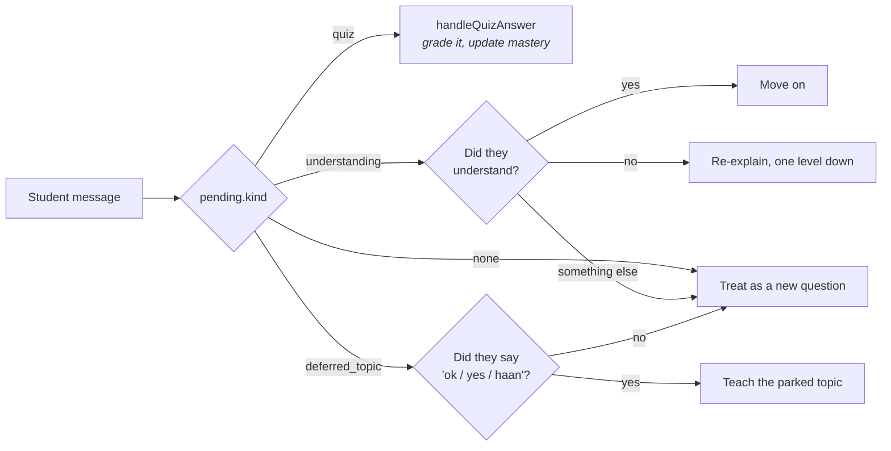
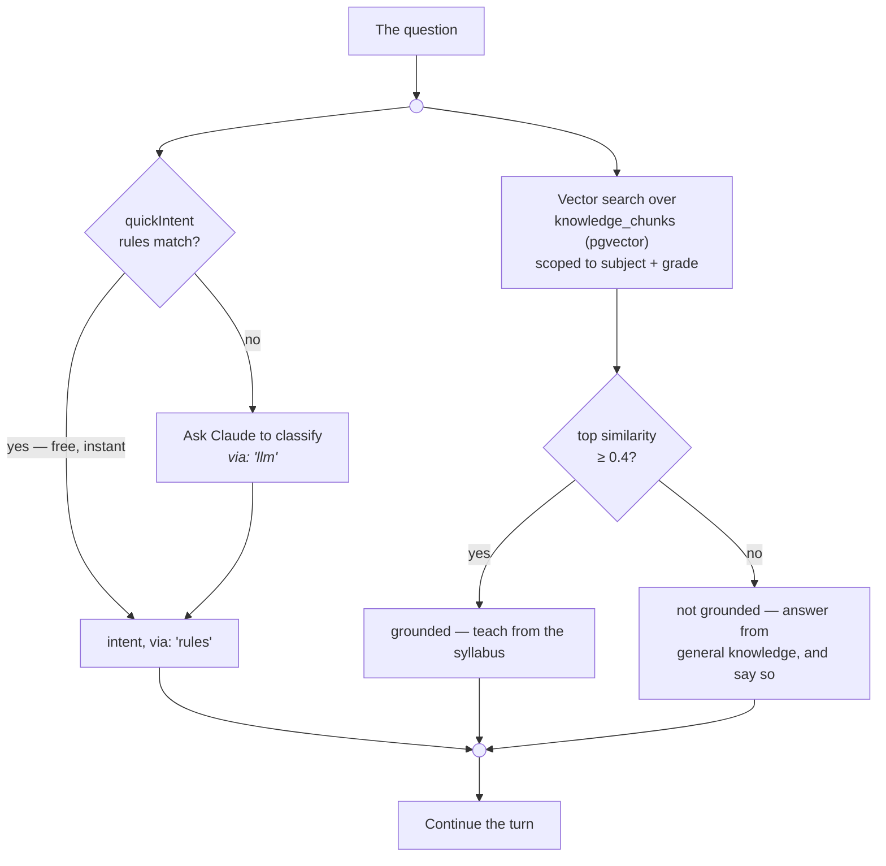
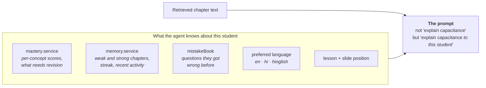
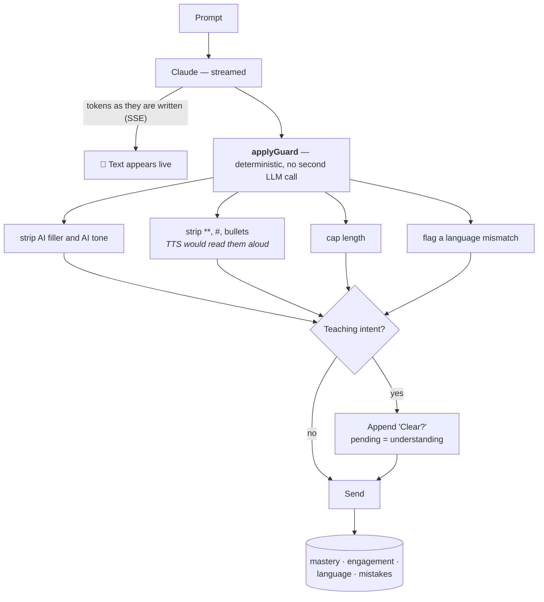
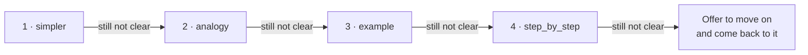

# Ailernova — How the AI Teacher Works

**25 September 2026** · `server/src/services/agent.service.js`

The AI teacher is a **stateful tutoring agent**, not a chat wrapper around an LLM.
Each turn it decides what kind of message it received, whether the syllabus covers
it, who is asking, and what to do next — and it writes back what it learned so the
next turn starts better informed.

Diagrams are Mermaid, so they render on GitHub.

---

## Contents

1. [The whole turn, end to end](#1-the-whole-turn-end-to-end)
2. [Stage 1 — Is this a reply to something?](#2-stage-1--is-this-a-reply-to-something)
3. [Stage 2 — Understand and retrieve, in parallel](#3-stage-2--understand-and-retrieve-in-parallel)
4. [Stage 3 — The cheap exits](#4-stage-3--the-cheap-exits)
5. [Stage 4 — Build the student's context](#5-stage-4--build-the-students-context)
6. [Stage 5 — Generate, guard, and close the loop](#6-stage-5--generate-guard-and-close-the-loop)
7. [The re-explanation ladder](#7-the-re-explanation-ladder)
8. [Why it is built this way](#8-why-it-is-built-this-way)

---

## 1. The whole turn, end to end



The four cheap exits on the right matter: a greeting, a goodbye, an off-topic
message and a subject switch are all answered **before** any retrieval, any student
lookup, and any LLM call.

---

## 2. Stage 1 — Is this a reply to something?

The agent carries a `pending` object between turns. Before doing any work it asks
what it was waiting for — this is what makes it an agent rather than a chatbot.



> **The escape hatch.** In every branch, "something else" falls through to a normal
> new question. A student who changes the subject is never trapped in a loop waiting
> to answer a quiz they have lost interest in.

---

## 3. Stage 2 — Understand and retrieve, in parallel



Two deliberate choices live here:

- **Rules before the LLM.** `quickIntent()` catches greetings, thanks, stop and the
  obvious cases for free. Only genuinely ambiguous messages cost a classification call.
- **A grounding floor of 0.4**, raised from the config default of 0.2. Below it the
  agent admits the curriculum does not cover the question rather than dressing a weak
  match up as the textbook.

---

## 4. Stage 3 — The cheap exits

Checked in this order, each returning before any expensive work:

| # | Condition | Reply |
|---|---|---|
| 1 | `intent = greeting` | A warm line in the student's language |
| 2 | `intent = stop_lesson` | Ends the lesson, carries `action: 'end_lesson'` so the player closes |
| 3 | A **different subject** named mid-lesson | Parks the request, promises to return to it, sets `pending = deferred_topic` |
| 4 | `intent = off_topic` | Redirects to the lesson |

Every one of these is answered from canned lines in English, Hindi or Hinglish — no
retrieval, no LLM, no cost.

> The stop reply is the one early return that deliberately carries **no** resume cue.
> Every other exit offers "let's continue"; the one thing a goodbye must not say is
> "let's continue".

---

## 5. Stage 4 — Build the student's context

Only the teaching intents reach this stage. Several independent reads are overlapped.



This is the difference between an LLM answering a question and a tutor teaching a
person. The retrieved syllabus text says *what* is true; the student context decides
*how* it should be said.

---

## 6. Stage 5 — Generate, guard, and close the loop



`applyGuard` is deliberately **not** an LLM pass. It is a set of deterministic rules,
so cleanup costs nothing and cannot itself hallucinate.

---

## 7. The re-explanation ladder

When a student says they did not understand, the agent does not repeat itself. It
moves one step down a fixed ladder:



```js
STRATEGY_ORDER = ['simpler', 'analogy', 'example', 'step_by_step']
```

Four genuinely different attempts, each a different teaching strategy rather than the
same explanation restated.

---

## 8. Why it is built this way

| Decision | Reason |
|---|---|
| **Rules before the LLM** for intent | Most turns are greetings, confirmations or obvious questions. Paying for a classification call on "ok" is waste |
| **Grounding floor at 0.4**, not the default 0.2 | A weak match presented as curriculum is worse than an honest general answer |
| **Cheap exits before retrieval** | A goodbye should not trigger a vector search and four student lookups |
| **Deterministic guard, not a second LLM** | Cleanup is rules-shaped. A second model call would add cost, latency and a new way to be wrong |
| **Pending state with an escape hatch** | Continuity matters, but a student who changes their mind must never be stuck |
| **Write back every turn** | The agent's job is to get better at teaching *this* student, which requires remembering |

### In one sentence, for an interview

> It is a stateful tutoring agent: each turn it checks whether the message continues a
> pending quiz or understanding check, classifies intent with rules before paying for
> an LLM, retrieves from the curriculum with a similarity floor so it can admit when
> something is not covered, builds the prompt from that student's mastery and mistake
> history, streams the answer, runs a deterministic cleanup, closes the loop by
> checking understanding — escalating through four re-explanation strategies — and
> writes back what it learned.
