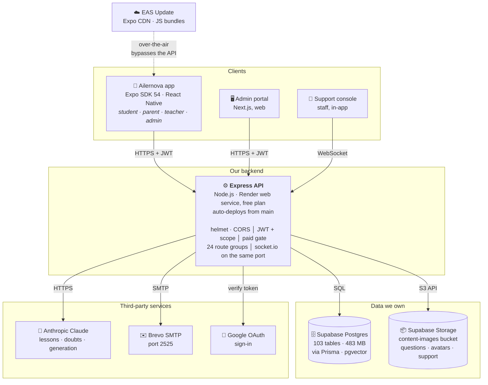
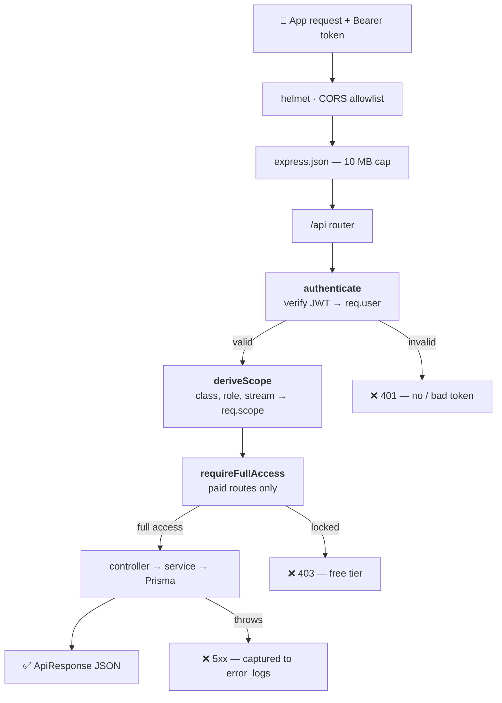
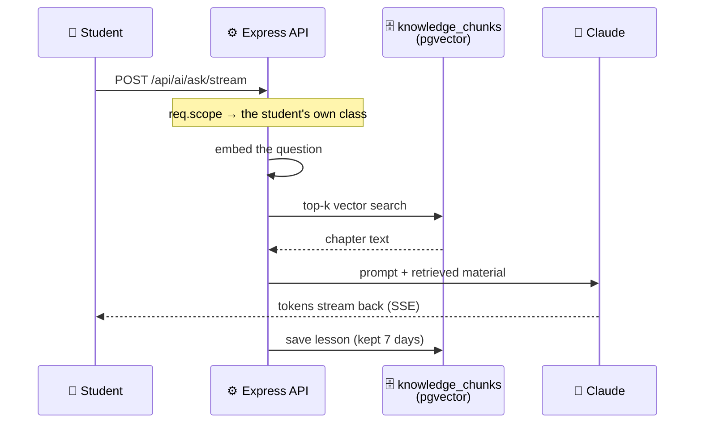
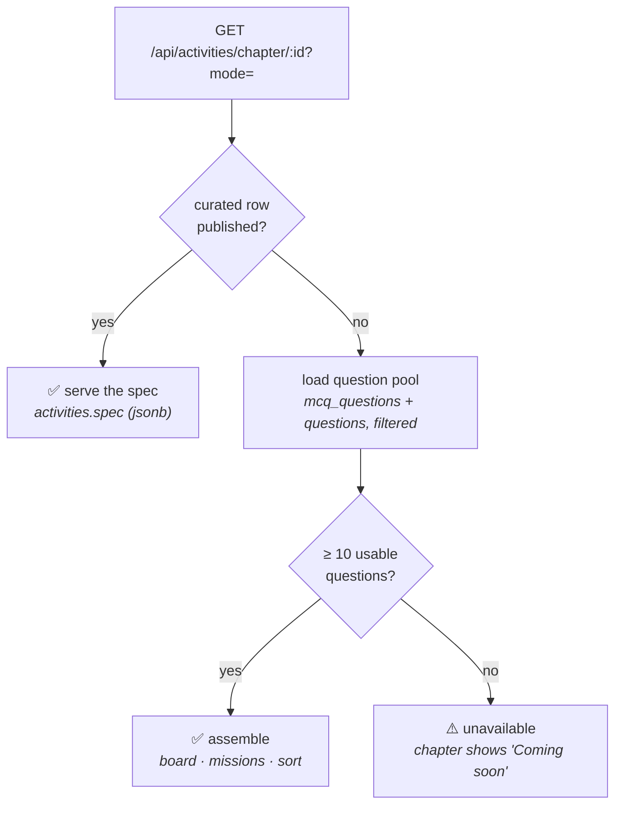
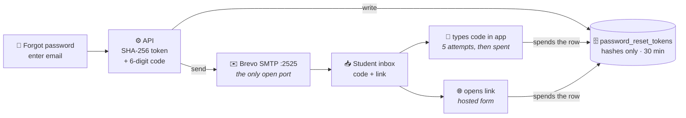
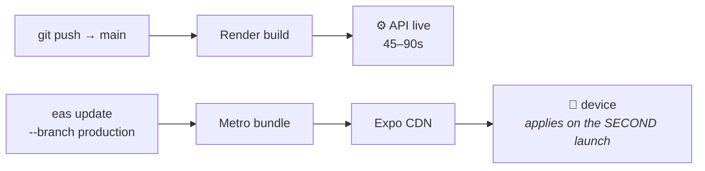

# Ailernova — System Architecture

**19 September 2026** · `main` at `bccc89b`

How the Expo app, the Express API and every external service fit together.
Diagrams are Mermaid, so they render on GitHub and in most Markdown viewers.

---

## Contents

1. [The system map](#1-the-system-map)
2. [Stack and hosting](#2-stack-and-hosting)
3. [Life of a request](#3-life-of-a-request)
4. [Route groups](#4-route-groups)
5. [Flow: the AI teacher](#5-flow-the-ai-teacher)
6. [Flow: an activity](#6-flow-an-activity)
7. [Flow: password reset](#7-flow-password-reset)
8. [Two ways code ships](#8-two-ways-code-ships)
9. [What breaks when](#9-what-breaks-when)

---

## 1. The system map

Everything a student, parent, teacher or admin does passes through **one Express
service**. It is the only thing holding credentials for the database, for Claude and
for the mail relay — no client ever talks to those directly.

> **The one path that bypasses the server:** app JavaScript reaches devices straight
> from Expo's CDN. That is why an app change and a server change ship independently —
> see [§8](#8-two-ways-code-ships).

---

## 2. Stack and hosting

| Layer | Technology | Where it runs |
|---|---|---|
| Mobile app | React Native 0.81 · Expo SDK 54 · React Navigation | Android; Play build 6 + OTA updates |
| Admin portal | Next.js + TypeScript | Separate web deploy |
| **API** | **Node.js · Express 4 · Prisma 5.22 · socket.io** | **Render web service, free plan** |
| Database | PostgreSQL 15 + pgvector | Supabase (free tier, 483 of 500 MB) |
| File storage | Supabase Storage, public bucket | Supabase |
| AI | `@anthropic-ai/sdk` — Claude | Anthropic API |
| Email | `nodemailer` over SMTP, port 2525 | Brevo relay |
| Auth | JWT (HS256) + Google OAuth + bcrypt | In-process |

Render builds with `npm ci && npx prisma generate`, starts with `npm start`, and
health-checks `/api/health`. A push to `main` deploys automatically in 45–90 seconds.

---

## 3. Life of a request

Every call enters the same pipeline. What matters is **where a request can leave
early** — three of the four exits happen before any controller code runs, which is
why authorisation is cheap to reason about here.

Every paid route is wrapped as `paid(router)`, which is
`[authenticate, requireFullAccess, router]` — so a free account never reaches the
controller, and the controller never has to check.

Source: [`server/src/index.js`](../server/src/index.js),
[`server/src/routes/index.js`](../server/src/routes/index.js),
[`server/src/middleware/auth.js`](../server/src/middleware/auth.js)

---

## 4. Route groups

24 groups under `/api`, in four access tiers.

| Tier | Groups | Gate |
|---|---|---|
| Open | `/health` `/config` `/cms` `/auth` | None — sign-in and password reset must work before a token exists |
| Signed in | `/brain-gym` `/arena` `/support` `/parent` `/logs` `/learning` `/teacher` `/jobs` | `authenticate` |
| Paid | `/ai` `/knowledge` `/tts` `/avatar` `/resources` `/mcq-practice` `/activities` `/online-tests` `/offline-tests` `/mock-tests` `/sessions` | `authenticate` + `requireFullAccess` |
| Staff | `/admin` | `requireAdmin` + per-permission checks |

The free tier deliberately keeps Brain Gym and the Arena — a student who has not paid
still has something to do, and those games fall back to a bundled question bank when
the server is unreachable.

---

## 5. Flow: the AI teacher

The most involved path, and the only one that streams. The server never forwards a
question to Claude on its own — it first retrieves the chapter's own material from
the database, so answers are grounded in the syllabus rather than general knowledge.

Because the finished lesson is stored, **"Continue" replays it without calling Claude
again** — which is also why a Claude outage does not break lessons already generated.

---

## 6. Flow: an activity

A genuine branch, and the one that makes the feature scale: the server prefers a
hand-written activity and builds one from the chapter's question banks when none
exists.

That is why **1,689 of 1,718 chapters are playable** with nobody authoring an
activity — and why a hand-written one can replace an assembled one at any time,
chapter by chapter, with no app change.

Source: [`server/src/services/activities.service.js`](../server/src/services/activities.service.js)

---

## 7. Flow: password reset

The one flow that leaves our infrastructure entirely and comes back through the
student's inbox.

The same request issues **a code and a link**. The code keeps a student on their
phone inside the app; the link exists for mail opened on a desktop. Only hashes are
stored, so a leaked database backup cannot be used to take an account.

Port 2525 is not a preference — it is the **only outbound SMTP port Render's free
plan permits** (465 and 587 time out to every destination).

---

## 8. Two ways code ships

A consequence of §1 that is easy to trip over: backend and app deploy on different
rails, at different speeds, and a feature usually needs both.

| | Backend | App |
|---|---|---|
| Trigger | `git push` to `main` | `eas update --branch production` |
| Path | GitHub → Render build → live | Metro bundle → Expo CDN → device |
| Time | 45–90 seconds | ~2 minutes to publish |
| Reaches users | Immediately | On the **second** launch — `fallbackToCacheTimeout: 0` means a launch uses the cached bundle and fetches the new one behind it |
| Limits | Anything | JavaScript only; native changes need a new Play build |

> ⚠️ **The ordering rule — deploy the server first.** A new app bundle calling an
> endpoint that does not exist yet gets a 404 and shows an error; an old bundle
> against a new server simply ignores the new routes. This is the failure that
> produced "Could not load subjects" while the Activities backend sat unpushed.

---

## 9. What breaks when

| If this fails | Still works | Stops working |
|---|---|---|
| **Express / Render** | Sign-in state, practice, resources and tests from the 229 MB bundled in the app; Brain Gym and Arena on local fallbacks | New sign-ins, AI teacher, progress saving, support, admin, anything served from the database |
| **Supabase** | Nothing meaningful — the API needs it on almost every request | Effectively the whole service |
| **Claude** | Everything else; lessons already generated replay from cache for 7 days; Brain Gym falls back to deterministic questions | New lessons and doubt answers (502 with an honest message) |
| **Brevo** | Everything else | Password reset — and *silently*, because `/forgot-password` answers identically either way; `/api/health?check=mail` is the only thing that reports it |

The failure most students actually meet is none of these: Render's free plan spins
the service down after about 15 minutes idle, and the next request pays a cold start
of up to 50 seconds. The app's HTTP timeout is set to 60 seconds specifically to
survive it.
